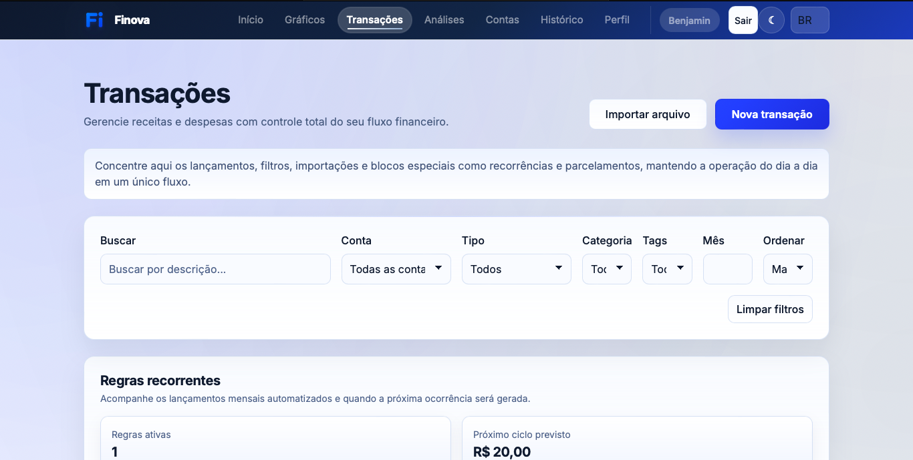
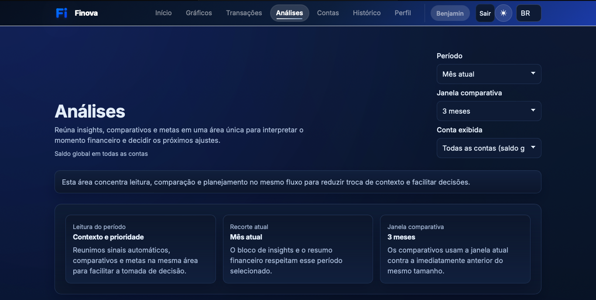
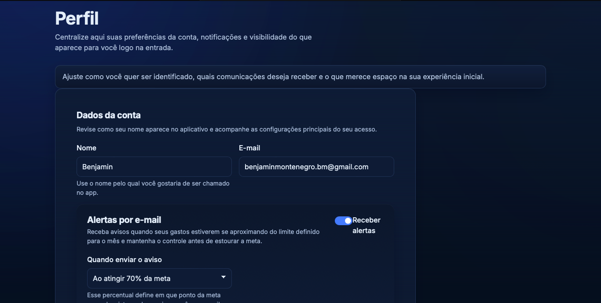

# Héstia

Héstia é uma aplicação full stack de controle financeiro pessoal criada para tornar a gestão do dinheiro mais clara, segura e fácil de acompanhar. O produto reúne autenticação, conta demo, gestão de transações, gráficos, metas, recorrências, parcelamentos, contas financeiras, exportações, notificações e painel público somente leitura.

English version: [README.md](README.md)

## Prévia

| Início | Transações |
| --- | --- |
|  |  |

| Análises | Perfil |
| --- | --- |
|  |  |

## O que a Héstia faz

A Héstia permite:

- criar conta e fazer login com JWT protegido em cookie `HttpOnly`
- confirmar e-mail no cadastro
- recuperar e redefinir senha por e-mail
- explorar o produto com uma conta demo
- cadastrar, editar, remover, filtrar, importar e exportar transações
- acompanhar receitas, despesas, saldo, categorias e tags
- organizar contas financeiras e filtrar dados por conta
- definir metas mensais gerais e por categoria
- acompanhar lançamentos recorrentes e compras parceladas
- visualizar gráficos, comparativos, previsões e insights prescritivos
- receber alertas de metas e resumo mensal por e-mail
- compartilhar um painel público somente leitura
- revisar histórico de auditoria para fluxos sensíveis
- alternar entre tema claro e escuro

## Stack

### Frontend

- React 19
- Vite
- React Router
- Bootstrap 5
- Recharts
- i18next / react-i18next
- Vitest, Testing Library, Playwright

### Backend

- ASP.NET Core 10
- Entity Framework Core 10
- PostgreSQL em produção, com SQL Server preservado para compatibilidade local
- JWT em cookie `HttpOnly`, com suporte Bearer para clientes externos
- Scalar.AspNetCore
- envio de e-mail atrás da abstração `IEmailSender`, desativado até a configuração do domínio da Héstia
- base de backend Pluggy para futuros fluxos de Open Finance

### Infraestrutura

- Vercel para o frontend React
- Railway para a API ASP.NET Core
- Neon PostgreSQL para os dados persistidos
- GitHub como repositório-fonte

## Arquitetura em resumo

```text
Héstia/
|-- client/                          # Frontend React/Vite
|-- server/
|   |-- FinanceDashboard.Api/        # API ASP.NET Core
|   |-- docker-compose.yml           # SQL Server local opcional
|   `-- .env.example                 # Exemplo de ambiente local
|-- tests/
|   `-- FinanceDashboard.Api.Tests/  # Testes automatizados do backend
|-- docs/
|   |-- HESTIA_TRANSITION_ROADMAP.md # Checklist de rebranding e cutover
|   |-- roadmap.md                   # Roadmap técnico e de produto
|   |-- changelog.md                 # Histórico por marco de entrega
|   `-- architecture-decisions.md    # Decisões e racional do projeto
`-- finance-dashboard-react.sln
```

O frontend encaminha `/api/*` pela Vercel para o serviço da Railway. Clientes diretos podem usar a URL da API na Railway com `/api`.

## Implantação

A arquitetura de produção é:

- Frontend: Vercel
- Backend: Railway
- Banco: Neon PostgreSQL

O renome coordenado e as fronteiras de rollback estão documentados no [roadmap de transição Héstia](docs/HESTIA_TRANSITION_ROADMAP.md). O material da Azure permanece apenas como histórico de auditoria.

O domínio próprio ainda será definido. O Brevo deve permanecer desativado até que o domínio e os registros de autenticação de e-mail estejam prontos.

## Como rodar localmente

### 1. Banco de dados

Crie `server/.env` com base em `server/.env.example` e defina:

```env
SA_PASSWORD=SuaSenhaForteAqui
```

Suba o SQL Server:

```powershell
cd server
docker compose up -d
```

### 2. Backend

A API pode ser configurada com variáveis de ambiente ou com um arquivo local ignorado pelo Git, como `appsettings.Development.local.json`.

Configurações esperadas:

- `ConnectionStrings__Default`
- `Jwt__Key`
- `Jwt__Issuer`
- `Jwt__Audience`
- `Cors__AllowedOrigins__0`
- `Client__BaseUrl`
- `Notifications__Enabled`
- `Notifications__ProcessingIntervalMinutes`
- `Smtp__Host`
- `Smtp__Port`
- `Smtp__Username`
- `Smtp__Password`
- `Smtp__FromEmail`
- `Smtp__FromName`
- `Smtp__EnableSsl`
- `Demo__Enabled`
- `Demo__Name`
- `Demo__Email`
- `Demo__ResetLockTimeoutSeconds`
- `Demo__SessionLifetimeHours`
- `Pluggy__ClientId`
- `Pluggy__ClientSecret`

Você pode usar `server/FinanceDashboard.Api/appsettings.Development.local.example.json` como base.

Execute a API:

```powershell
cd server/FinanceDashboard.Api
dotnet run
```

URL padrão da API:

```text
http://localhost:5278
```

### 3. Frontend

```powershell
cd client
npm install
npm run dev
```

URL padrão do frontend:

```text
http://localhost:5173
```

Em desenvolvimento local, `client/src/lib/api/http.js` usa o fallback:

```text
http://localhost:5278/api
```

Em builds de produção, configure a URL do App Service ativo:

```text
VITE_API_URL=https://HOST-DA-SUA-API.azurewebsites.net/api
```

## Migrações

Para aplicar as migrations:

```powershell
cd server/FinanceDashboard.Api
dotnet ef database update
```

Esse passo é necessário sempre que uma nova migration alterar o schema do banco.

## Testes

Backend:

```powershell
dotnet test tests/FinanceDashboard.Api.Tests/FinanceDashboard.Api.Tests.csproj
```

Frontend:

```powershell
cd client
npm run lint
npm test
npm run build
```

End-to-end:

```powershell
cd client
npm run test:e2e
```

## Documentação

- [Guia de deploy no Azure](docs/azure-deploy.md)
- [Roadmap](docs/roadmap.md)
- [Changelog](docs/changelog.md)
- [Decisões de arquitetura](docs/architecture-decisions.md)
- [Checklist de segurança e confiabilidade](docs/security-hardening-checklist.md)

## Segurança

- Não versionar segredos.
- Manter configurações locais do backend fora do Git.
- Guardar senhas do SQL Server apenas em ambientes seguros.
- Não expor links de redefinição de senha em logs de produção.
- Manter `Client__BaseUrl` fixado na origem confiável do frontend.
- Manter o rate limit ativo nos endpoints públicos de autenticação.
- Invalidar sessões quando o token expirar ou quando houver inatividade prolongada.
